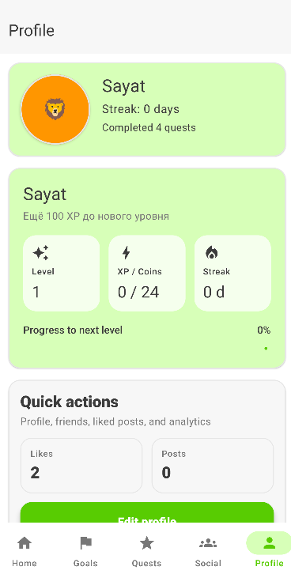

<p align="center">
  
</p>

# 🚀 QuestPlanner

> 🚀 Full-stack AI Planner with AI support

---

## 📱 О проекте

QuestPlanner — мобильное приложение для планирования задач и личного прогресса в игровом формате.  
Пользователь выполняет задачи, получает XP, повышает уровень и отслеживает свой прогресс.

---

## 🏗 Архитектура
Android app → Nginx → FastAPI → PostgreSQL

- **Android app** — получает данные через API  
- **Nginx** — reverse proxy  
- **FastAPI** — обработка запросов  
- **PostgreSQL** — хранение данных  

---

## 🎮 Геймификация

- 🧠 XP начисляется за выполнение задач  
- 📈 Level повышается с опытом  
- 🔥 Streak мотивирует поддерживать активность  

---

## 🤖 AI + Telegram Bot

- 📅 составление планов (день / неделя / месяц)  
- 🎯 помощь в постановке целей  
- 🧠 рекомендации через OpenAI  

<p align="center">
  
</p>

---

## ⚙️ API (Swagger)

👉 http://YOUR_IP:8000/docs  

> ⚠️ Замените YOUR_IP на адрес сервера или используйте localhost

<p align="center">
  
</p>

---

## 🚀 Запуск

```bash
docker compose up -d --build
