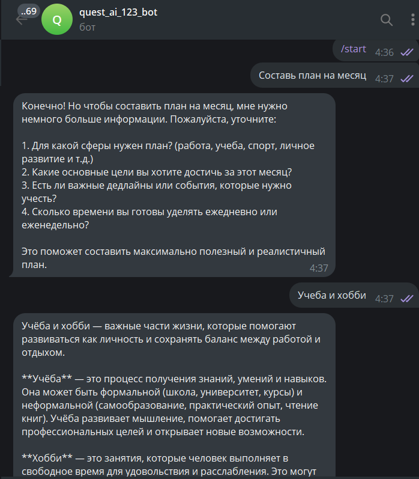
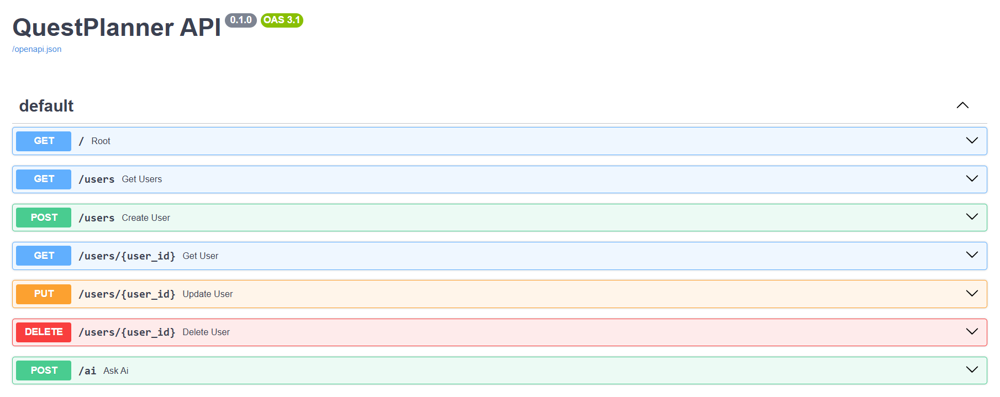

# 🚀 QuestPlanner

> 🚀 Full-stack AI Planner with DevOps infrastructure


---

## ⚡ Features

- 🤖 AI ответы (OpenAI)
- 📱 Telegram бот
- ⚙️ FastAPI backend
- 🐳 Docker (multi-container)
- 🔁 Jenkins CI/CD
- 📊 Monitoring (Prometheus + Grafana)
- ☁️ Terraform (IaC)

---

## 🧠 AI Planner

Система помогает пользователю:

- 📅 составлять планы (день / неделя / месяц)
- 🎯 ставить цели
- 🧠 получать персонализированные AI-рекомендации

---

## 🏗 Architecture

<p align="center">

Client → Nginx → FastAPI → PostgreSQL  
Monitoring → Prometheus → Grafana  
CI/CD → Jenkins  
AI → OpenAI + Telegram Bot  

</p>

---

## 🤖 Telegram Bot

Бот позволяет:

- 📅 составлять планы (день / неделя / месяц)
- 🎯 ставить цели
- 🧠 получать AI-рекомендации

<p align="center">
  
</p>

---

## ⚙️ API (Swagger)

Документация доступна по адресу:

👉 http://YOUR_IP:8000/docs  

> ⚠️ Замените `YOUR_IP` на адрес вашего сервера  
> или используйте `localhost`

<p align="center">
  
</p>

---

## 🚀 Run

```bash
docker compose up -d --build
